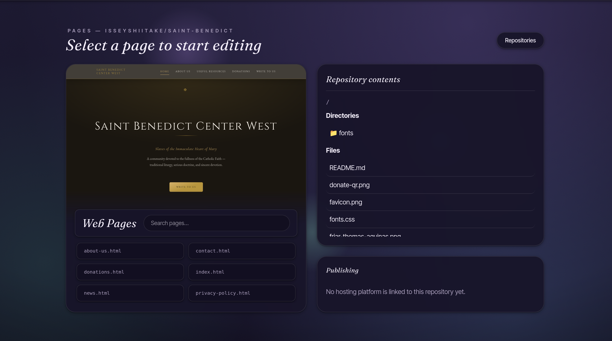
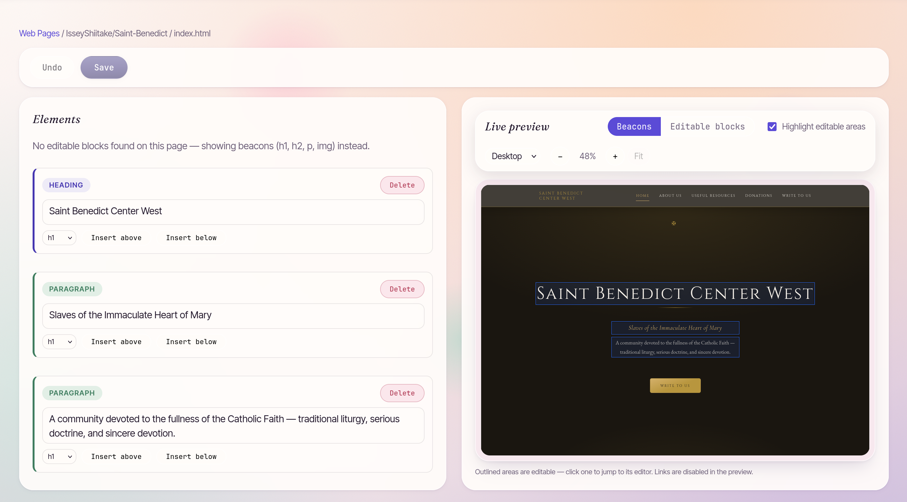
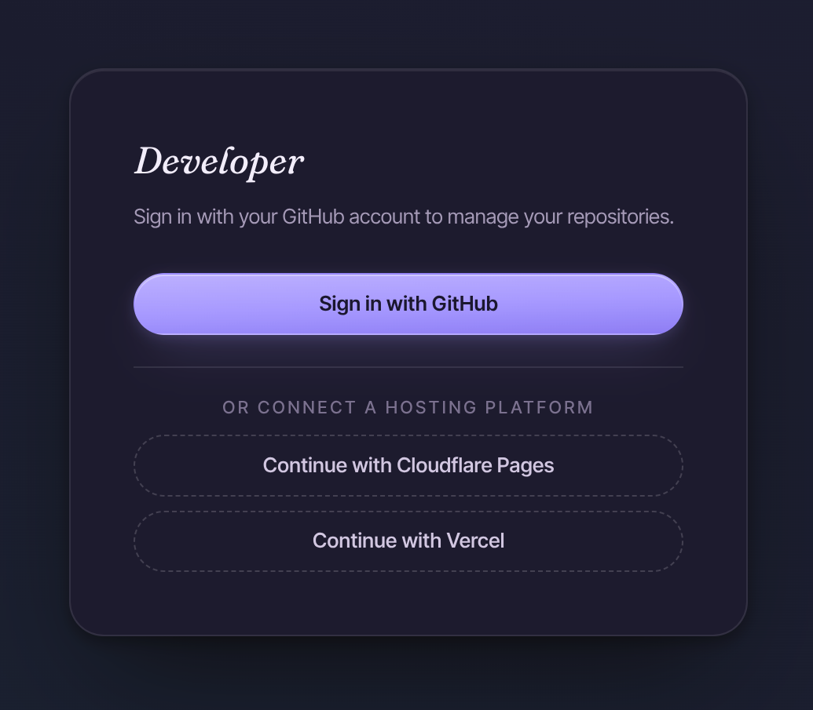
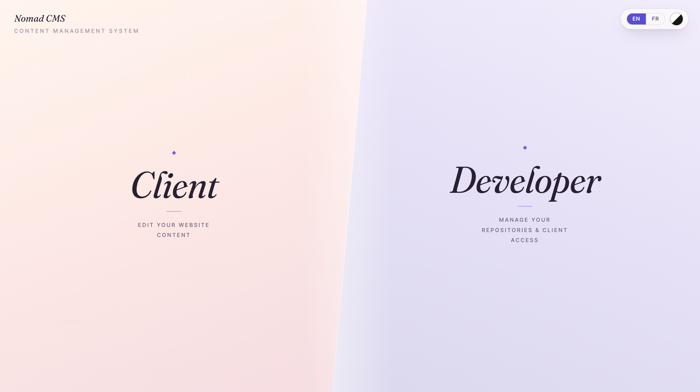
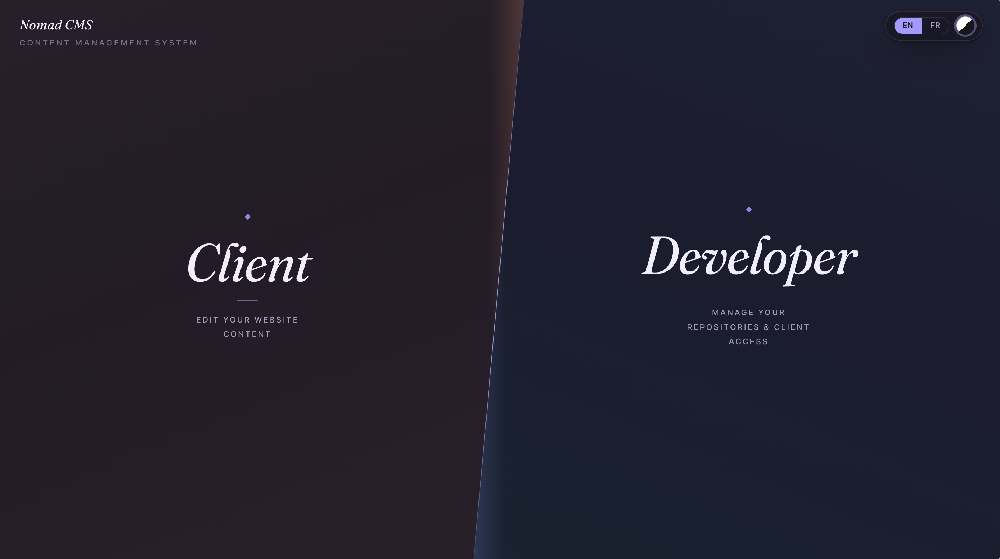

# Nomad CMS

[](https://github.com/IsseyShiitake/Nomad-CMS/actions/workflows/ci.yml)

A lightweight CMS for editing static HTML websites stored in GitHub repositories. The whole CMS — API and UI — is a single Cloudflare Worker that you deploy on your own Cloudflare account. Sign in with GitHub, edit your pages in a visual editor, and every save is a commit; optionally trigger Cloudflare Pages / Vercel production deployments on publish.



## Screenshots

| | |
| --- | --- |
|  |  |
|  |  |



## Features

- **GitHub OAuth sign-in** — authenticate with your GitHub account.
- **Repository browser** — list, search, and filter your repositories.
- **HTML page discovery** — find all HTML files in a repository.
- **DOM-based HTML scanner** — detect editable elements (h1, h2, p, img, `data-editable`).
- **In-browser editor** — edit text, replace images, delete/insert elements with a live preview.
- **Save & commit** — commit changes back to GitHub with a clear message.
- **Image upload** — upload local images and reference them in your pages.
- **Merge conflict handling** — surfaces conflicts so you can reload and re-apply.
- **Publish to Cloudflare Pages & Vercel** — connect your platform accounts, trigger production deployments after each save, and follow build status to the live URL. Vercel projects without a Git repository are editable directly.
- **Client accesses** — hand out restricted logins (locked to one repository, with their own UI language) to other people.
- **Security-first** — GitHub and platform credentials never reach the frontend.

## Run your own instance

Nomad CMS is single-tenant by design: you deploy your own Worker, register your own GitHub OAuth app, and exactly one GitHub login — yours — holds the admin role. Nobody shares your instance, and credentials never leave your Cloudflare account.

**What you need**

- a free Cloudflare account (Workers + Workers KV),
- a GitHub account,
- Node.js ^20.19.0 or >=22.12.0 with npm.

**The short version** — full guide in [`docs/deployment.md`](docs/deployment.md), beginner-friendly walkthrough in [`docs/tutorial-beginners.md`](docs/tutorial-beginners.md):

1. Clone this repository and run `npm install`.
2. Create a GitHub OAuth app (https://github.com/settings/developers, scope `repo`) and note its Client ID and client secret.
3. Create a KV namespace (`npx wrangler kv namespace create SESSIONS_NOMAD`) and copy its id into `packages/backend/wrangler.toml`.
4. In `wrangler.toml` `[vars]`, set `GITHUB_CLIENT_ID`, `GITHUB_REDIRECT_URI = https://<your-worker>.<your-subdomain>.workers.dev/auth/callback`, and `OPERATOR_LOGIN` = your own GitHub login (operator pinning: only that login can be the admin — every other GitHub login is rejected with `403 instance_locked`).
5. Set the secret with `npx wrangler secret put GITHUB_CLIENT_SECRET`. `SESSION_ENCRYPTION_KEY` is optional — the Worker self-provisions one into KV on first boot if omitted.
6. Run `npm run deploy` from the repository root.
7. Open your worker URL and sign in with GitHub.

Setup takes about ten minutes. A one-file download bundle with an interactive setup script (no clone required) is on the roadmap — until then, the steps above are the way.

### Security model

- **GitHub credentials never reach the frontend.** The Cloudflare Worker is the only component that holds the GitHub OAuth client secret. The session token is carried in an **HttpOnly cookie** (never readable by JavaScript); the frontend only ever sees the user's public profile.
- **GitHub and platform API tokens are encrypted at rest** in the Worker's KV namespace (`SESSION_ENCRYPTION_KEY`), so namespace read access alone does not expose them.
- **Secrets are never committed.** Local secrets live in `packages/backend/.dev.vars` (gitignored). Production secrets are set via `wrangler secret put`.
- **Security headers + CORS + CSRF** are applied to every API response; the frontend ships a CSP meta tag plus a `_headers` file honored by Workers Static Assets. Cross-origin credentialed calls require `ALLOWED_ORIGINS`, and state-changing methods require an `X-CSRF-Token` header.

## Local development

### Prerequisites

- Node.js ^20.19.0 or >=22.12.0
- npm

### Install

```bash
npm install
```

### Configure environment

**Frontend** — copy `packages/frontend/.env.example` to `packages/frontend/.env.local` and fill in values (defaults work as-is for local development).

**Backend** — copy `packages/backend/.dev.vars.example` to `packages/backend/.dev.vars` and fill in the secret values, plus the two local-dev var overrides for your OAuth app (see below).

### Run locally

```bash
# Terminal 1 — backend Worker
npm run dev:backend

# Terminal 2 — frontend
npm run dev:frontend
```

The frontend runs at `http://localhost:5173` and proxies `/api` requests to the Worker at `http://localhost:8787`.

### GitHub OAuth setup for local development

1. Create a GitHub OAuth app at https://github.com/settings/developers
   - **Homepage URL**: `http://localhost:5173`
   - **Authorization callback URL**: `http://localhost:5173/auth/callback`
   - Scope: `repo` (requested by the Worker when it builds the authorize URL)
2. In `packages/backend/.dev.vars`, set:
   - `GITHUB_CLIENT_SECRET` — the app's client secret,
   - `GITHUB_CLIENT_ID` and `GITHUB_REDIRECT_URI=http://localhost:5173/auth/callback` — these override the production `[vars]` from `wrangler.toml` during `wrangler dev`, pointing local login at your own app.
3. Create the KV namespace and put its id in `wrangler.toml`:
   ```
   npx wrangler kv namespace create SESSIONS_NOMAD
   ```
4. Set `OPERATOR_LOGIN` in `packages/backend/wrangler.toml` to your GitHub login (empty = the first sign-in claims the slot).
5. Start both dev servers and click **Sign in with GitHub** — the Worker builds the authorize URL server-side; no frontend OAuth configuration is needed.

See `docs/github-app.md` for full details, including migrating to a GitHub App.

### Build, typecheck, test

```bash
npm run build
npm run typecheck
npm test
```

## Project structure

This project is a **monorepo** with three packages:

| Package | Description |
| --- | --- |
| `packages/frontend` | React + TypeScript + Vite UI |
| `packages/backend` | Cloudflare Worker (TypeScript) API |
| `packages/shared` | Shared domain types used by both |

**Frontend** (`packages/frontend/src`):

- `api/` — typed HTTP client and endpoint modules
- `config/` — environment-derived configuration
- `services/` — domain services:
  - `htmlParser/` — DOM-based HTML parser (never regex)
  - `auth/` — session management (React context)
  - `editorState/` — editor state controller
  - `images/` — image manager
  - `publish/` — deployment trigger + build-status polling
- `features/` — feature pages (repositories, pages, editor, settings, publish panel)
- `ui/` — reusable layout and components

**Backend** (`packages/backend/src`):

- `index.ts` — Worker entry point
- `env.ts` — typed Worker environment
- `core/` — HTTP helpers + security headers
- `routes/` — API route modules (auth, repositories, deploy, preview, clients)
- `services/auth/` — OAuth code exchange + session manager
- `services/github/` — GitHub API client
- `services/deploy/` — Cloudflare Pages & Vercel clients, connection store, direct-storage adapter

## Documentation

- `docs/deployment.md` — end-to-end production deployment
- `docs/hosting-platforms.md` — Cloudflare Pages & Vercel publishing
- `docs/github-app.md` — GitHub OAuth App configuration
- `docs/cloudflare-worker.md` — Cloudflare Worker configuration
- `docs/static-assets.md` — static assets configuration
- `docs/production-checklist.md` — pre/post-deploy checklist
- `docs/tutorial-beginners.md` — beginner's tutorial (install, run, first edit)
- `docs/architecture.md` — architecture and key design decisions

## License

[MIT](LICENSE) © 2026 IsseyShiitake
